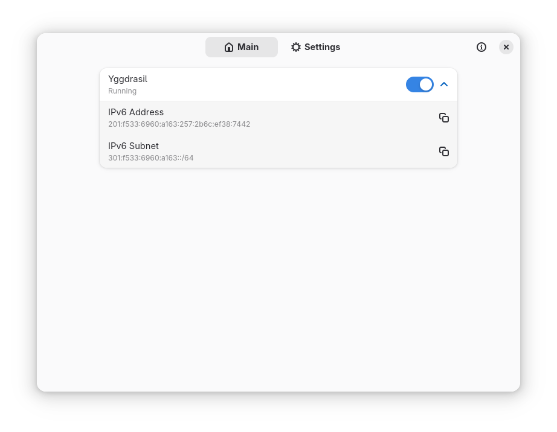
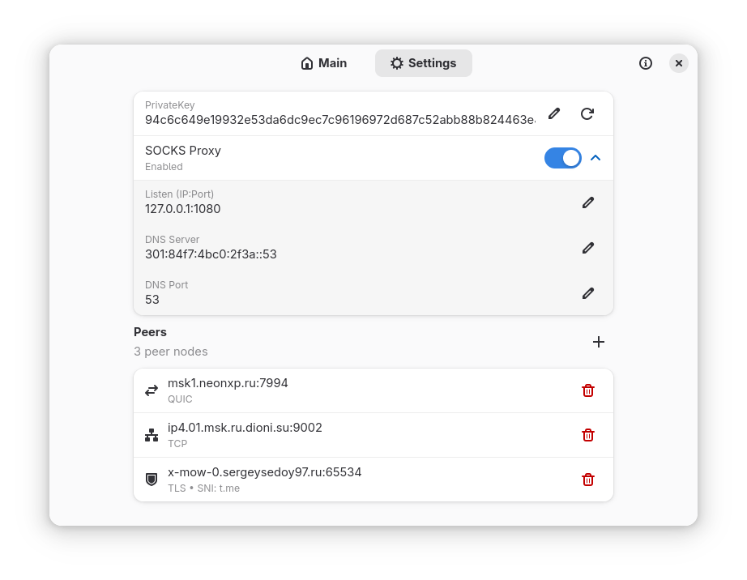

# Drosophila

Drosophila is a desktop application for running, configuring and monitoring a [Yggdrasil-ng](https://github.com/Revertron/Yggdrasil-ng) node.

## Features

- Run and monitor an embedded Yggdrasil-ng node
- Manage peers and the private key
- View the IPv6 address, subnet and peer status
- Connect through System Proxy, a local HTTP/SOCKS5 proxy or TUN

## Linux

### Flatpak

```bash
flatpak remote-add --user Drosophila https://ergolyam.github.io/Drosophila/ergolyam.flatpakrepo
flatpak install --user Drosophila io.github.ergolyam.Drosophila
```

Flatpak supports System Proxy and plain Proxy modes, but not TUN.

### Binary

Download a `glibc` or `musl` binary for `x86_64` or `aarch64` from the [releases page](https://github.com/ergolyam/Drosophila/releases). Use `musl` on Alpine Linux and `glibc` elsewhere.

GTK 4.12+ and libadwaita 1.6+ are required.

```bash
chmod +x ./Drosophila-*-linux-*
./Drosophila-*-linux-*
```

Native binaries include TUN. See [Linux development](docs/development-linux.md#tun-access) for PolicyKit setup.

## Windows

Download and run the installer from the [releases page](https://github.com/ergolyam/Drosophila/releases). Configuration is stored in the application directory.

## Build

- [Linux](docs/development-linux.md)
- [Windows](docs/development-windows.md)

## Screenshots

| Main page | Settings |
|---|---|
|  |  |

## License

GPL-3.0-or-later. Yggdrasil-ng is licensed under MPL-2.0.
