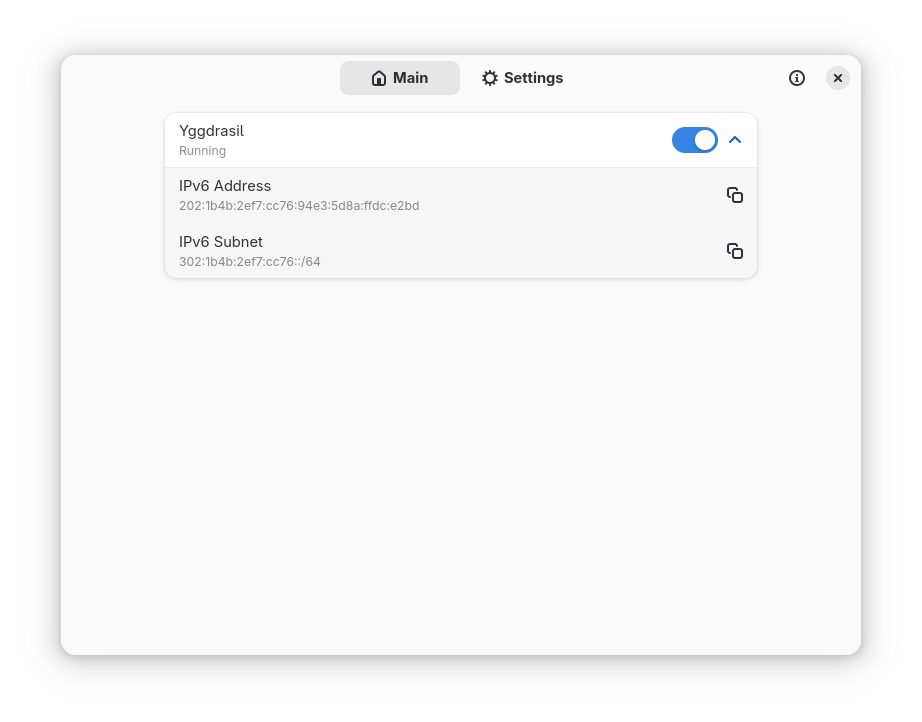
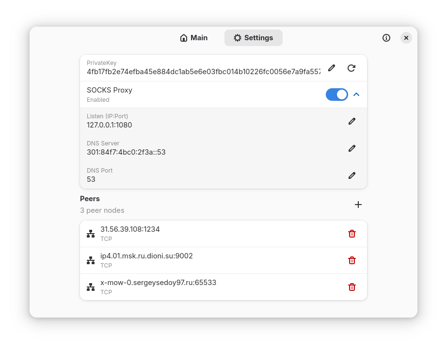

# Drosophila
A modern GTK 4 + libadwaita desktop interface for running, configuring and monitoring a local [Yggdrasil](https://github.com/yggdrasil-network/yggdrasil-go) overlay-network node on Linux and Windows.

## Quick start

### Flatpak

```bash
flatpak remote-add --user Drosophila https://ergolyam.github.io/Drosophila/ergolyam.flatpakrepo
flatpak install --user Drosophila io.github.ergolyam.Drosophila
```

### Windows

Download the latest Windows build from the [releases page](https://github.com/ergolyam/Drosophila/releases) and run it and extract the portable app folder. Run `Drosophila.exe` from the extracted folder

### AppImage

Download the latest AppImage from the [releases page](https://github.com/ergolyam/Drosophila/releases) and make it executable:

```bash
chmod +x Drosophila-*.AppImage
./Drosophila-*.AppImage
```

### Python package

```bash
pip install --upgrade git+https://github.com/ergolyam/Drosophila.git@main#egg=Drosophila
python -m yggui
```

## Documentation

- [Linux development](.github/docs/development-linux.md)
- [Windows development](.github/docs/development-windows.md)

## Screenshots

| Screenshot 1                                          | Screenshot 2                                             |
|-------------------------------------------------------|----------------------------------------------------------|
|         |         |

## Features

- One-click switch toggle Yggdrasil daemon or Yggstack SOCKS proxy
- Live status panel showing IPv6 address and /64 subnet
- Peer management with validation and persistence
- Optional SOCKS5 proxy & DNS forwarder via Yggstack
- Private-key viewer / editor / generator
- Clipboard helpers for address & subnet
- Flatpak-aware: automatically moves required binaries into the sandbox
- Graceful shutdown on exit or SIGINT

## License

This program is free software: you can redistribute it and/or modify it under the terms of the **GNU General Public License, version 3 or (at your option) any later version** published by the Free Software Foundation.

Copyright © 2025 ergolyam

See the full license text in the [LICENSE](license) file or online at <https://www.gnu.org/licenses/gpl-3.0.txt>.
